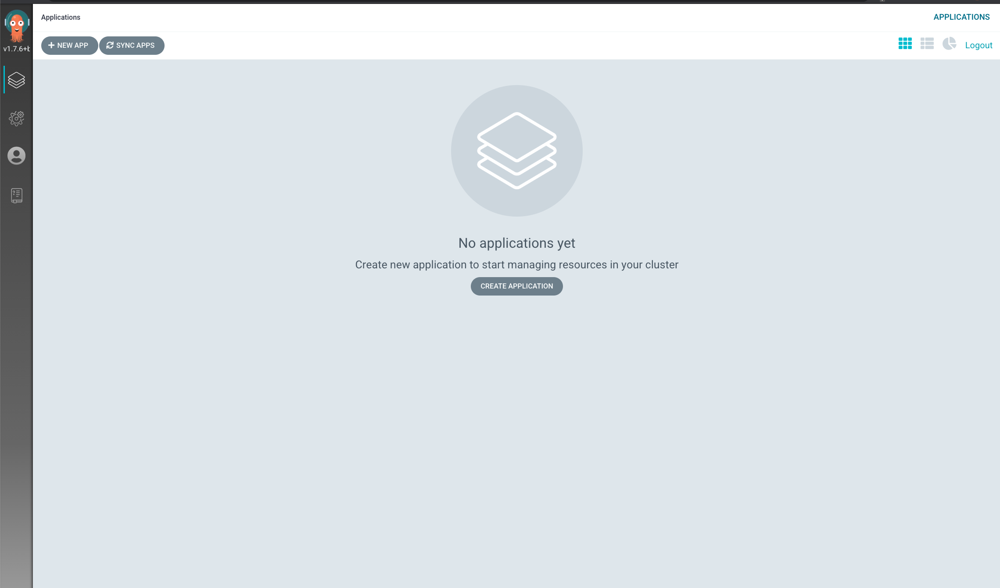

# Delivering the example using GitOps and ArgoCD

# Prerequisites

##  Install ArgoCD

You can find detailed instructions on how to install ArgoCD [here](https://argoproj.github.io/argo-cd/getting_started/)    

For your convenience, this will install ArgoCD on your cluster

```
kubectl create namespace argocd
kubectl apply -n argocd -f
https://raw.githubusercontent.com/argoproj/argo-cd/stable/manifests/install.yaml
```

Please follow the rest of the documentation to expose your the ArgoCD UI and get
access by retrieven the password. 

## Fork the podtato-head project

This example modifies files within the repository, so you will need your own
fork. The original podtato head repository can be found
[here](https://github.com/cncf/podtato-head)

# Setting up the application in ArgoCD 

## Access the ArgoCD UI

If everything went fine so far you should now see the ArgoCD UI. 



Now either click on ```New App``` at the top or ```Create Application``` in the
middle of the screen. This will open a screen like this. We will walk through
the configuration in the next part. 


## Creating a new application


# Deploying application versions


## Syncing the project

## Updating the project to a new version


